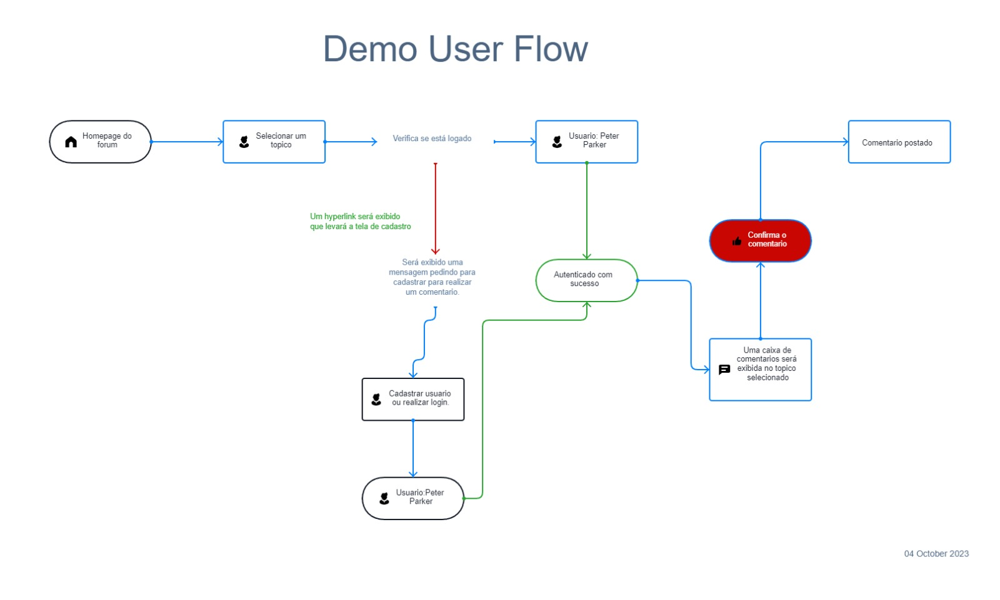
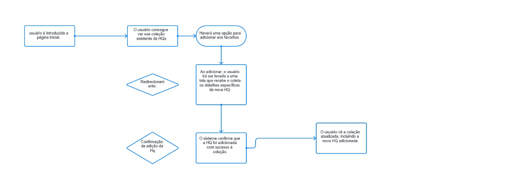
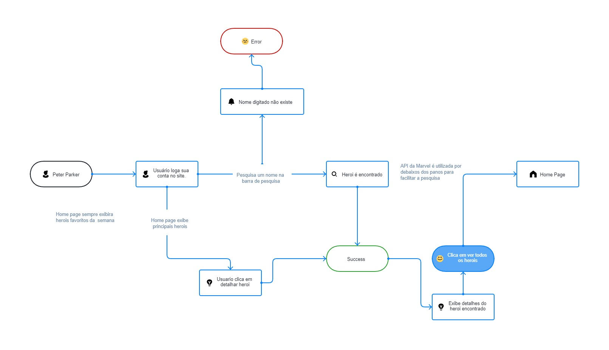
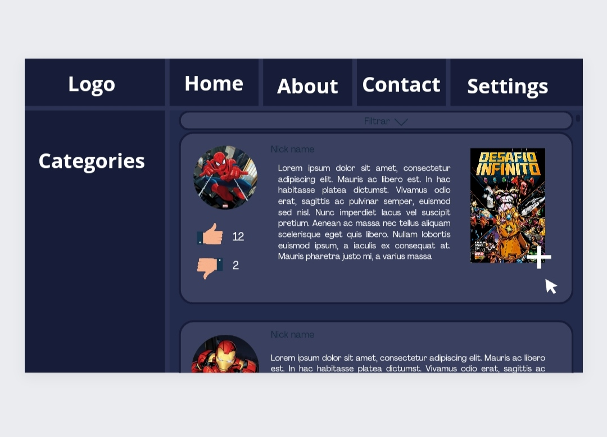
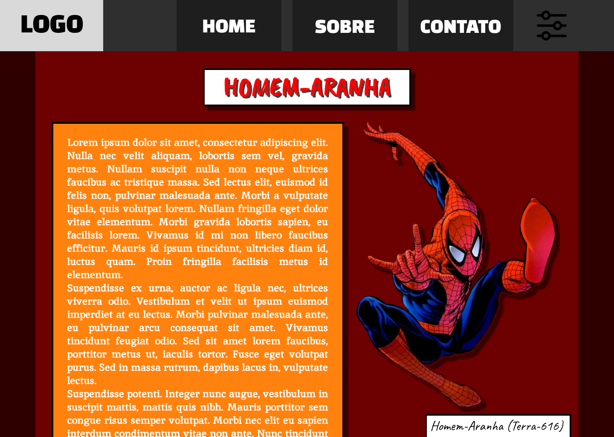

# Projeto de Interface

<a href="2-Especificação do Projeto.md"> Documentação de Especificação</a>.

## User Flow

<h3>Fluxo de Comentários no Fórum sobre os Heróis</h3>

 

O fluxo de comentários apresenta uma ideia de como o tráfego ocorrerá, tanto pela perspectiva do usuário quanto pelos processos que ele precisará seguir para fazer um comentário no fórum dos heróis.

<h3>Fluxo de adição de Hq`s a coleção do usuário </h3>

  
 
 O Fluxo de favoritos funciona para a visualização de todas as etapas desde a pesquisa e seleção de uma hq escolhida até a integração perfeita na coleção. 
 
=======
<h3>Fluxo de pesquisa de um heroi especifico</h3>

  

 O Fluxo de pesquisa para um heroi mostra o caminho que o usario fará caso queira achar um heroi de sua preferencia.

## Wireframes

<h3>1- Exemplo de tela para os foruns de debate sobre herois.</h3>

  

.

A tela Inicial apresenta um menu lateral com as principais seções do portal, enquanto a navigation bar, ao topo, apresenta informações de envio de imagens ou navegação pela galeria de fotos. A área central apresenta a galeria de fotos na forma de uma grade.

<h3>1- Exemplo de tela para os detalhar personagens.</h3>

  

.

A tela apresenta  a navigation bar padrão do site, ao topo, apresenta informações do heroi que foi buscado pelo usuario atraves de imagens pela galeria de fotos. A área central apresenta um descrição sobre o heroi e suas participações em hq's e filmes.

